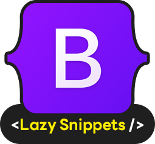

# Bootstrap 5 Lazy Snippets

## Tired of switching tabs to look up Bootstrap 5 components? 

Bootstrap 5 Lazy Snippets is your ultimate VS Code companion for rapid Bootstrap 5 development. This extension provides a comprehensive collection of essential Bootstrap 5 HTML snippets, allowing you to instantly generate common components with just a few keystrokes. Say goodbye to repetitive typing and constant documentation checks – boost your coding speed and focus on building amazing UIs!

## ✨ Features

This extension provides a wide array of Bootstrap 5 components and structures as easy-to-use snippets. Simply type the prefix (e.g., bs-card, bs-modal, bs-btn-primary) and press Tab or Enter to insert the complete HTML structure.

## Key features include:

| **Component**     | **Snippet(s)**                                                                 | **Description** |
|-------------------|--------------------------------------------------------------------------------|-----------------|
| HTML Boilerplate  | `!bs5`                                                                         | Basic HTML5 with Bootstrap 5 CSS/JS CDN |
| Accordion         | `bs5-accordion`, `bs5-accordion-flush`, `bs5-accordion-open`                   | Various accordion types with items |
| Alerts            | `bs5-alert-primary`, `bs5-alert-success`                                       | Alert variations |
| Badges            | `bs5-badge-primary`, `bs5-badge-pill-success`                                  | Regular and pill-shaped badges |
| Breadcrumbs       | `bs5-breadcrumb`                                                               | Standard breadcrumb navigation |
| Buttons           | `bs5-button-primary`, `bs5-button-outline-danger`                              | Solid, outline, link buttons, button groups, split dropdowns |
| Cards             | `bs5-card-img`                                                                 | Card structure with images |
| Carousels         | `bs5-carousel`, `bs5-carousel-indicators`, `bs5-carousel-captions`, `bs5-carousel-fade` | Carousel types with default slides |
| Collapse          | `bs5-collapse`                                                                 | Basic collapse with trigger |
| Dropdowns         | `bs5-dropdown`, `bs5-dropdown-divider-danger`, `bs5-dropdown-split-danger`     | Standard/split dropdowns, dividers |
| List Groups       | `bs5-list-group`                                                               | Unordered list group |
| Modals            | `bs5-modal`                                                                    | Complete modal with trigger and content |
| Navbar            | `bs5-navbar-search`                                                            | Responsive navbar with search |
| Offcanvas         | `bs5-offcanvas`                                                                | Slide-out offcanvas component |
| Pagination        | `bs5-pagination`                                                               | Basic pagination component |
| Popovers          | `bs5-popover-top`, `bs5-popover-right`, `bs5-popover-bottom`, `bs5-popover-left` | Buttons with popover (various placements) |
| Progress Bars     | `bs5-progress-bar`                                                             | Progress bars with percentages |
| Scrollspy         | `bs5-scrollspy-navbar`                                                         | Scrollspy with navbar and sections |
| Spinners          | `bs5-spinner`                                                                  | Border spinner |
| Toasts            | `bs5-toast-live`                                                               | Live toast notification with trigger |
| Tooltips          | `bs5-tooltip-top`                                                              | Tooltip buttons with custom themes |

## ⚙️ Requirements

This extension does not have any external runtime requirements or dependencies beyond Visual Studio Code itself. All snippets are pure HTML with Bootstrap 5 classes, relying on Bootstrap's CSS and JavaScript (which you typically include via CDN in your project).

## 🔧 Extension Settings

This extension does not contribute any VS Code settings through the contributes.configuration extension point. It focuses solely on providing code snippets.

## 🐛 Known Issues

No known major issues at this time.

(If you discover any issues during testing or after release, list them here. E.g., "Tooltips and Popovers require manual JavaScript initialization in your project, as per Bootstrap's documentation.")

## 📝 Release Notes

1.0.0
Initial release of Bootstrap 5 Lazy Snippets.

Includes boilerplate HTML (!bs5) with Bootstrap 5 CDN.

Comprehensive collection of snippets for Accordions, Alerts, Badges, Breadcrumbs, Buttons, Cards, Carousels, Collapse, Dropdowns, List Groups, Modals, Navbars, Offcanvas, Pagination, Popovers, Progress Bars, Scrollspy, Spinners, Toasts, and Tooltips.

Optimized for quick insertion with intuitive prefixes and helpful tabstops.

Enjoy faster Bootstrap 5 development! 🚀